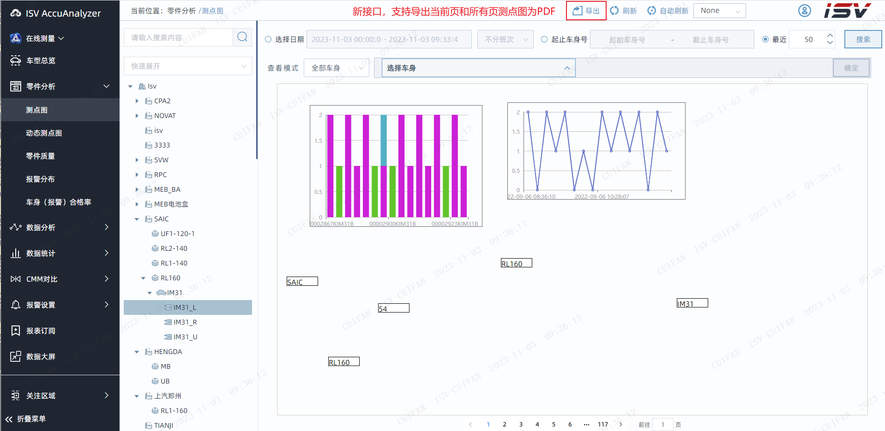
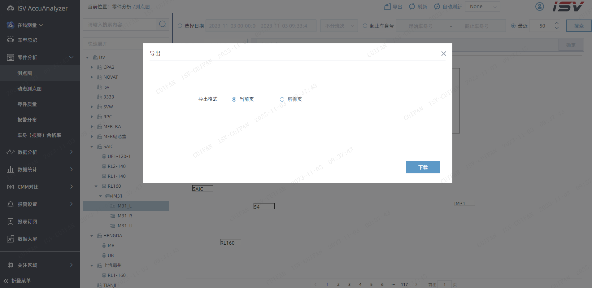
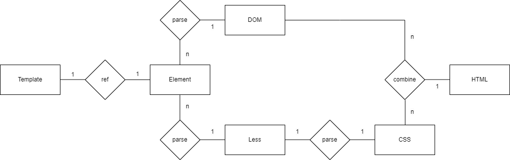

# 动态导出HTML为PDF设计

## 设计目的

用于描述XX系统内部关于PDF导出功能的详细设计，用于指导后续的开发和测试。

## 运行环境

- `Node`版本：`V18.9.0`
- `pkg`版本：`5.8.1`

## 安装依赖

```shell
npm install
```

## 打包为Win平台

```shell
pkg .\pdfgenerator.js -t win -o pdfgenerator
```

## 配置文件说明

- `puppeteer.config.cjs`：更改 `Puppeteer` 用于安装浏览器的默认缓存目录。

> 注：在执行`npm`安装依赖时，会自动下载与当前 ` puppeteer-core` 版本匹配的 `chromium`。如果要修改默认的下载路径，务必添加`path.resolve(__dirname)`，否则 `npm` 会把 `chromium` 安装到 `C ` 盘，导致运行失败。
>
> ```js
> const {join} = require('path');
> 
> /**
>  * @type {import("puppeteer").Configuration}
>  */
> module.exports = {
>   // Changes the cache location for Puppeteer.
>   cacheDirectory: join(__dirname, '.cache', 'puppeteer'),
> };
> ```

- `pdfgenerator.config.json`：服务配置信息，包括**日志大小**限制，**端口号**。
- `.cache`：`npm` 过程中缓存的 `chromium`。
- `pdfgenerator.exe`：打包整个`Node`服务得到的可执行文件。

- `pdfgenerator.vbs`：用于在`pdfgenerator.exe`运行过程中隐藏窗口。

## 功能设计





### 前端：



#### 实现思路：

1. 获取待打印元素，指定配置信息（静态资源地址，`PDF`宽高、名称）
2. 从当前页开始，跳转页面，等待当前页面所有数据请求完成
3. 获取当前页待打印元素的模板字符串并保存
4. 所有页面跳转完毕，跳转回初始页，发起请求，提交所有保存的模板字符串
5. 收到响应，转换`base64`到`blob`格式对象，保存`blob`格式对象并下载为`PDF`

### 后端：

#### 实现思路：

1. 接收请求，提取静态资源地址、`PDF`宽高、模板字符串数组等参数
2. 根据静态资源地址修改所有模板字符串中的静态资源引用
3. 启动无头浏览器、创建新的页面、日志服务
4. 循环模板字符串数组，用模板填充该页面，打印为`PDF`并保存
5. 合并所有页面的`PDF`，压缩，转`base64`返回

#### 功能函数：

`getFolderSize`：获取指定文件夹的大小

`clearHalfFolder`：删除指定文件夹下的前一半文件（根据名称排序）

`compressPDF`：使用指定方式压缩指定`PDF`

`mergePDF`：合并多个`PDF`为一页

`handleHTMLReference`：修改模板字符串的静态资源引用

## 接口功能描述

### 请求内容

| 请求方法 | 请求URI      | URI示例                      |
| -------- | ------------ | ---------------------------- |
| POST     | /point_graph | /v1/pdfgenerator/point_graph |

### 请求参数

| 字段         | 类型   | 是否必传 | 默认值    | 备注                     |
| ------------ | ------ | -------- | --------- | ------------------------ |
| htmlContents | Array  | 否       | []        | 需要打印的HTML字符串数组 |
| width        | Number | 否       | 485       | 输出PDF每页的宽度        |
| height       | Number | 否       | 275       | 输出PDF每页的高度        |
| host         | String | 否       | /v1/file/ | 第三方静态资源主机地址   |

### 返回内容

> responseType为base64.

```js
{
	config: {
        url: 'http://172.17.17.38:8093/isv/v1/pdfgenerator/point_graph', 
        method: 'post', 
        data: '{"width":1359,"height":732,"htmlContents":["<html>…ml>"],"host":"http://172.17.17.38:8093/v1/file/"}', 	
        headers: {…}, 
        transformRequest: Array(1),
    },
        
    // data 为 base64信息
    data: "data:application/pdf;base64,JVBERi0xLjcKJYGBgYEKC...",
        
    headers: {
        access-control-allow-headers: 'Origin, X-Requested-With, Content-Type, Accept, auth', 
        access-control-allow-methods: 'GET, POST, PUT, DELETE, OPTIONS', 
        access-control-allow-origin: '*, *', 
        connection: 'keep-alive', 
        content-length: '33772',
       
    },
	request: XMLHttpRequest {
        readyState: 4, 
        timeout: 0, 
        withCredentials: false, 
        upload: XMLHttpRequestUpload, 
        onreadystatechange: *ƒ*,
    },
	status: 200,
	statusText: "OK",
}
```


