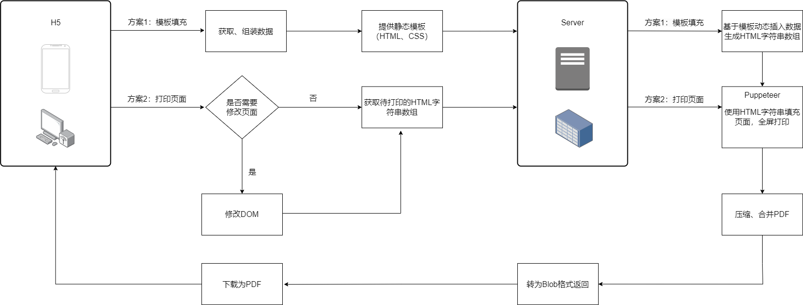
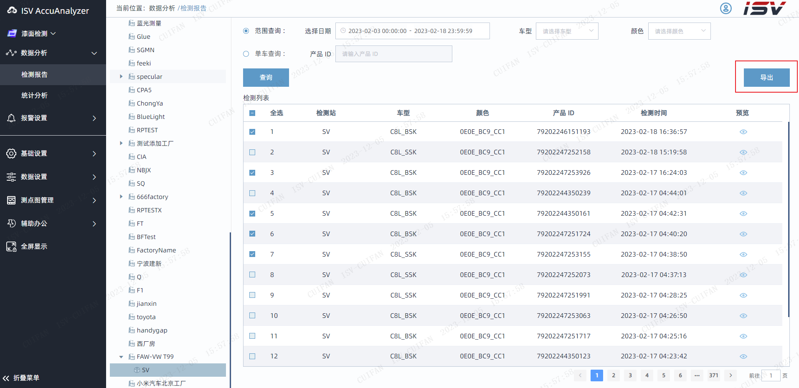
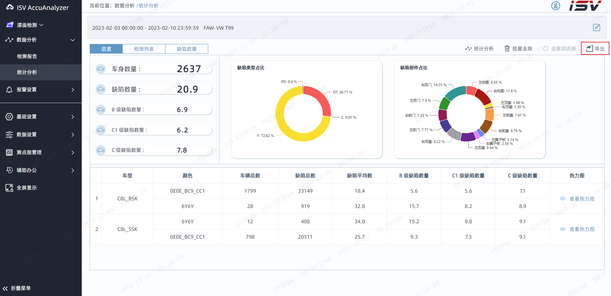

# 动态导出HTML为PDF

## 环境相关

- `Node`版本：`V18.9.0`
- `pkg`版本：`5.8.1`

### 安装依赖

```shell
npm install
```

### 打包为Win平台

```shell
pkg .\pdfgenerator.js -t win -o pdfgenerator
```

### 配置文件说明

- `puppeteer.config.cjs`：更改 `Puppeteer` 用于安装浏览器的默认缓存目录。

> 注：在执行`npm`安装依赖时，会自动下载与当前 ` puppeteer-core` 版本匹配的 `chromium`。如果要修改默认的下载路径，务必为`cacheDirectory`指明绝对路径，否则默认安装在`C`盘，导致运行失败。
>
> ```js
> const {join} = require('path');
>     module.exports = {
>       cacheDirectory: join(__dirname, '.cache', 'puppeteer'),
> };
> ```

- `pdfgenerator.config.json`：服务配置信息，包括**日志大小**限制，**端口号**。
- `.cache`：`npm` 过程中缓存的 `chromium`。
- `pdfgenerator.exe`：打包整个`Node`服务得到的可执行文件。

- `pdfgenerator.vbs`：用于在`pdfgenerator.exe`运行过程中隐藏窗口。

## 设计目的

用于描述`Web`项目关于动态打印`HTML`为`PDF`的详细功能设计，用于指导后续的开发和维护工作。

## 设计出发点

解决`H5/Vue/React/`原生`js`页面生成`PDF`，都会遇到的问题，做到导出所见即所得。

- 各个浏览器、手机兼容性

- 内容截断：包括不限于`echart `图表截断、动态`table`行截断

- 生成动态内容`PDF`等

- 批量下载`PDF`稳定性

## 难点分析

### 动态分页层面

需要将不确定内容的素材，如`Canvas`、`svg`、动态图像、动态图表、不定长的表格进行数据填充并修改、删除后，合理地放到`PDF`页面中。

### 吞吐量

需要满足用户批量操作，一个用户可以同时生成多份PDF报告。

### 交互层面

如果`PDF`过大，生成时间过长，需要通知前端生成阶段和进度。

## 功能模块设计



### 方案1：

根据模板导出：

- 前端
  - 获取模板需要的数据
  - 提供模板、样式
- 后端
  - 使用模板渲染将数据插入模板中
  - 打印该模板为PDF

### 方案2：

根据元素导出（所见即所得）：

- 前端
  - 获取待打印元素
  - 克隆该元素，编辑克隆后的元素
  - 获取克隆后元素的模板、样式
- 后端
  - 打印该模板为PDF

## 接口功能描述

### 获取填充后的模板

#### 请求内容

| 请求方法 | 请求URI       | URI示例                       |
| -------- | ------------- | ----------------------------- |
| POST     | /get_template | /v1/pdfgenerator/get_template |

#### 请求参数

| 字段 | 类型   | 是否必传 | 默认值 | 备注           |
| ---- | ------ | -------- | ------ | -------------- |
| data | Object | true     | {}     | 填充模板的数据 |

#### 返回参数

| 字段    | 类型   | 备注                     |
| ------- | ------ | ------------------------ |
| htmlStr | String | 经过数据填充的HTML字符串 |

### 打印页面

#### 请求内容

| 请求方法 | 请求URI      | URI示例                      |
| -------- | ------------ | ---------------------------- |
| POST     | /point_graph | /v1/pdfgenerator/point_graph |

#### 请求参数

| 字段         | 类型   | 是否必传 | 默认值    | 备注                                |
| ------------ | ------ | -------- | --------- | ----------------------------------- |
| htmlContents | Array  | true     | []        | 待打印的HTML字符串数组              |
| width        | Number | false    | 1200      | 输出的PDF每页的宽度                 |
| height       | Number | false    | 1200      | 输出的PDF每页的高度                 |
| host         | String | false    | /v1/file/ | http://localhost:{port}(服务端口号) |
| scale        | Number | false    | 1         | 缩放倍数                            |

#### 返回参数

| 字段 | 类型   | 备注         |
| ---- | ------ | ------------ |
| data | Object | Blob格式对象 |

## 前端代码示例：

### 方案1：



```js
import {pdfDownload, getHTMLStr} from '@/common/utils/fileExport';
// 根据模板打印多份选中的检测报告
async exportReport() {
    for (let i = 0; i < this.multipleSelection.length; i++) {
        const tableData = this.multipleSelection[i];
        // 获取报告数据
        const reportData = await this.getReportInfo(tableData, 'isv/v1/file/');
        // 获取数据填充后的模板
        const htmlStr = await this.$http.post(`/v1/pdfgenerator/get_template`, {
            ...tableData,
            ...reportData,
        });
        // 编辑该模板
        ...
        // 打印当前模板为PDF
        await pdfDownload({
            width: 374,
            height: 510,
            host: window.location.origin,
            htmlContents: [htmlStr],
            name: 'test.pdf',
        });
    }
}
```

### 方案2：



```js
import {pdfDownload, getHTMLStr} from '@/common/utils/fileExport';
async confirmExport() {
    // 待导出为PDF的元素
    const pdfElement = this.$refs.pdfNode;
    // 获取该元素的HTML模板字符串
    const htmlStr = await getHTMLStr(pdfElement);
    // 编辑该模板字符串
    ...
    // 导出该模板字符串为PDF
    await pdfDownload({
        name: 'test.pdf',
        host: window.location.origin,
        htmlContents: [getHTMLStr(pdfElement)],
        width: pdfElement.clientWidth,
        height: pdfElement.clintHeight,
    })
}
```

## 待优化项

### 异步导出：

### 方案2：

- 请求体过大（>500KB）

  原因分析：提取了过多冗余的样式。

